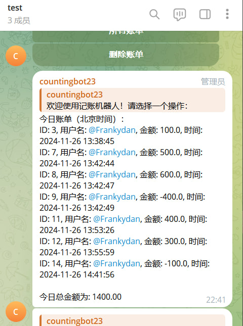

# countingbot

TG记账机器人

-  - 

记账机器人，python语言开发，部署简单，将机器人拉进群内后使用，每个用户发送的记账金额会存储在不同的数据库，当用户点击今日账单时会显示该用户的今日账单而不是群内所有人的账单。

具体功能有：

1、记账功能（可在群内直接发送+100或者-100 即可记账）

2、今日账单功能（记录了该用户的今日所有记账的账单，且结尾有今日账单的总和）

3、所有账单功能（记录了该用户所有账单）

4、删除账单功能（根据编号进行需要删除的账单）

50U是源码和部署教程，若需要帮忙搭建需要加多50U 联系TG@Frankydan

联系TG:@Frankydan
